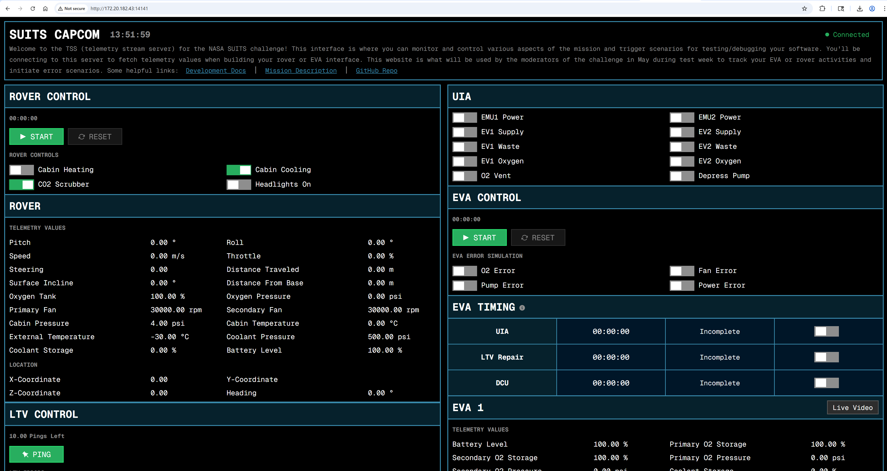

# TSS 2026

NASA Spacesuit User Interface Technologies for Students ([SUITS](https://www.nasa.gov/learning-resources/spacesuit-user-interface-technologies-for-students/)) is a design challenge in which college students from across the country help design user interface solutions for future spaceflight needs.
The following is a web interface for the SUITS telemetry stream server designed and developed for the challenge.

<div style="display: flex; flex-direction: row; width: fit-content; gap: 10px;">
    
    <div style="display: flex; flex-direction: column; gap: 10px;">
        
        
    </div>
</div>

## Introduction

TSS stands for telemetry stream server. It is the centralized server for sending and receiving data for the challenge. All data from the lunar simulator DUST is sent to TSS, and any commands to control the pressurized rover, or fetch data will be sent to TSS. The following document will detail how you can run your own instance of the server and begin developing your software and hardware.

### Navigation

- <a href="#getting-started">Getting Started</a>
- <a href="#peripheral-devices">Peripheral Devices</a>
- <a href="#dust-simulation">DUST Simulation</a>
- <a href="#development">Development</a>
- <a href="#testing">Testing</a>
- <a href="#jsc-test-weekk">JSC Test Week</a>
- <a href="#questions">Questions</a>

### Helpful Links

- [Mission Description](https://www.nasa.gov/wp-content/uploads/2025/09/fy26-suits-mission-description.pdf?emrc=345f62?emrc=345f62)
- <a href="/documents/acronym-list.pdf">Acronym List</a>
- <a href="/documents/maps/">Rock Yard and DUST Maps</a>
- <a>Rock Yard 3D Scans @TODO</a>
- <a href="/documents/eva-telemetry-ranges.pdf">EVA Telemetry Ranges</a>
- <a href="/documents/rover-telemetry-ranges.pdf">Rover Telemetry Ranges</a>

## Getting Started

1. Clone the repository:

`git clone https://github.com/SUITS-Techteam/TSS2026.git`

2. Navigate into the root of the repository on your terminal of choice

3. Allow the build script to be ran as an executable:

`chmod +x ./build.bat`

4. To build the server, run:

`
./build.bat` **NOTE:** If running on Windows, you will have to setup [WSL](https://learn.microsoft.com/en-us/windows/wsl/about) and install GCC. If you don't, several errors will be displayed when trying to build the server.

5. To start the server, run:

`./server.exe`

You should see the following lines in your terminal appear:

```
Launching Server at IP: 172.20.182.43:14141
Configuring Local Address...
Creating HTTP Socket...
Binding HTTP Socket...
Listening to HTTP Socket...
Creating UDP Socket...
Binding UDP Socket...
Listening to UDP Socket...
Backend and simulation engine initialized successfully
```

6. Type the IP address printed in the first output for "Launching Server at IP: xxx.xx.xxx.xx:14141". This will open the website for the server. From this website, you can interact with the server. This is where you can monitor the state of the simulation, verify the display of your system, and virtually interact with the EVA devices like you will be doing in May.



## Peripheral Devices

The devices listed below are physical devices that will be used during test week to create a realistic scenario for both the EVA and rover teams. The sensor data listed below will be synced with the telemetry server and can be fetched for use within your interface.


### UIA

The umbilical interface assembly (UIA) is a component used at the beginning of an EVA to transfer power and fluids to the suit.

| Sensor       | Value True | Value False | Description                        |
| ------------ | ---------- | ----------- | ---------------------------------- |
| EMU1 POWER   | ON         | OFF         | Remotely powers the suit for EVA 1 |
| EV1 SUPPLY   | OPEN       | CLOSED      | Fills EVA 1's liquid coolant       |
| EV1 WASTE    | OPEN       | CLOSED      | Flushes EVA 1's liquid coolant     |
| EV1 OXYGEN   | OPEN       | CLOSED      | Fills EVA 1's oxygen tanks         |
| EMU2 POWER   | ON         | OFF         | Remotely powers the suit for EVA 2 |
| EV2 SUPPLY   | OPEN       | CLOSED      | Fills EVA 1's liquid coolant       |
| EV2 WASTE    | OPEN       | CLOSED      | Flushes EVA 1's liquid coolant     |
| EV2 OXYGEN   | OPEN       | CLOSED      | Fills EVA 1's oxygen tanks         |
| O2 Vent      | OPEN       | CLOSED      | Flushes both EVAs oxygen tanks     |
| DEPRESS PUMP | ON         | OFF         | Pressurizes both EVA suits         |

### DCU

The display and control unit (DCU) used for this challenge is a component that allows the user to control various settings of their suit's operation during an EVA. For example, if scrubber A's CO2 storage fills up, you could flip a switch on the DCU to flush it while switching to scrubber B.

| Sensor  | Value True | Value False     | Description                                                                                           |
| ------- | ---------- | --------------- | ----------------------------------------------------------------------------------------------------- |
| BATTERY | SUIT BATT  | UMBILICAL POWER | Describes if the suit is running off its local battery or UIA power                                   |
| OXYGEN  | PRI TANK   | SEC TANK        | Describes if the suit is pulling from primary or secondary oxygen tanks                               |
| COMMS   | Channel A  | Channel B       | Describes if the suit is connected to Channel A or Channel B on comms                                 |
| FAN     | PRI FAN    | SEC FAN         | Describes if the suit is using the primary fan or secondary fan                                       |
| PUMP    | OPEN       | CLOSED          | Describes if the coolant pump for the suit is open or closed (allows water to be flushed or supplied) |
| CO2     | Scrubber A | Scrubber B      | Describes which scrubber is currently filling with CO2 (other is venting)                             |

## DUST Simulation

[DUST](https://software.nasa.gov/software/MSC-27522-1) (Digital Lunar Exploration Sites Unreal Simulation Tool) is a 3D visualization of the Lunar South Pole built in Unreal Engine. Since we can not use a physical rover to drive around in during test week, you will use this software developed by NASA to simulate a pressurized rover.


### Requesting access

After being selected as a team to participate in the rover segment of the NASA SUITS challenge, your team lead will be contacted via email with additional instructions to request access to the software. Please note that if your team was selected for the EVA segment of the challenge, you will not need to use this software.

### Connecting to the simulator

After opening the simulator on a Windows PC, a screen prompting you to enter an IP address should show up. This is prompting you to enter the website address for the TSS server, which is used to communicate back and forth with the simulator. You will want to setup the server on the same laptop or via a local network.

### Controls

During the challenge, you will be expected to issue commands to control the rover via TSS (see <a href="#rover-controls">rover commanding</a>). However for debug purposes, we have included several keyboard shortcuts that can be ran in the simulator to control the rover, reset the position, etc.

| Keyboard Shortcut | Description                                          |
| ----------------- | ---------------------------------------------------- |
| Cmd + R           | Reset the rover's position back to the starting base |

## Development

The telemetry server is an important part of the challenge as it will serve as the main way to communicate with the DUST lunar simulator for the rover team and fetch telemetry for both the EVA and rover teams. You'll take this telemetry data and use it within the respective interfaces that you are designing and developing ahead of test week. This section will outline how to connect to the data stream, data formats, and other helpful information for development.

### UDP socket communication

To create a more realistic scenario, we require that you request and send commands over the [user datagram protocol](https://www.cloudflare.com/learning/ddos/glossary/user-datagram-protocol-udp/) (UDP) instead of a HTTPS connection. For fetching data and issuing commands, you will use a specified command number, more details can be found below. Please note that all requests should be formatted in [big endian](https://www.geeksforgeeks.org/dsa/little-and-big-endian-mystery/) format.

The request packet should contain two different integers, the first is a UNIX timestamp, and the second is a command number. If you are requesting to change the value of a field (e.g. the throttle on the rover), then you will use an additional 4 bytes to set a new value for that field.

| Timestamp (unit32) | Command number (uint32) | Input Data (float) |
| ------------------ | ----------------------- | ------------------ |
| 4 bytes            | 4 bytes                 | 4 bytes (optional) |

The server will always send a UDP packet to acknowledge a request or change. If you are sending a packet to change a value (e.g. the throttle on the rover), then you will recieve a 4 byte response where a successful change will be indicated as true `(01000000)` and false as `(00000000)`. If requesting a JSON file (command numbers 0, 1, and 2), then the UDP response will be variable based on the JSON file length. You can convert these bytes back to JSON for use within your interfaces.

| Timestamp (unit32) | Command number (uint32) | Output Data    |
| ------------------ | ----------------------- | -------------- |
| 4 bytes            | 4 bytes                 | variable bytes |

These are the commands you can send to the server to fetch the telemetry data as JSON files. They directly correspond to the JSON files in `frontend/data`, and will be listed as such. Please note that the response from the UDP socket will be in byte format and you will need to convert it back to a human readable JSON format.

| Command number | Referenced .json file          |
| -------------- | ------------------------------ |
| 0              | [ROVER.json](/data/ROVER.json) |
| 1              | [EVA.json](/data/EVA.json)     |
| 2              | [LTV.json](/data/LTV.json)     |

Here is an example packet you can could send to fetch the ROVER.json file:

```
Timestamp: 1763414183 -> bytes: 691b90a7
Command: 0 -> bytes: 00000000

Full packet bytes: 691b90a700000000
Response bytes: 6041a0c26f7400007b0a092274656c656d65747279223a097b0 (+742 more bytes, decode the bytes as JSON)
```

### Rover controls

Controlling the rover is done through the same socket connection, and follows the same packet format with the addition of those final four bytes as mentioned above for issuing a new value for a specific field.

| Command number | Command  | Data input                 |
| -------------- | -------- | -------------------------- |
| 1107           | Brakes   | float: 0 or 1              |
| 1109           | Throttle | float: -100 (reverse), 100 |
| 1110           | Steering | float: -1.0, 1.0           |
| 1106           | Lights   | float: 0 or 1              |

(@TODO add the other commands)

Here is an example UDP packet to increase the rover to half throttle (50.0).

```
Timestamp: 1763412577 -> bytes: 691b8a61
Command: 1109 (Throttle) -> bytes: 00000455
Value: 50.0 -> bytes: 42480000

Full packet: 691b8a610000045542480000
Response packet: 01000000 (true)
```

### Rover LIDAR

The pressurized rover in the DUST simulation has 13 'LIDAR' sensors. Each of these sensors are points that shoot out a ray 10 meters in a direction. The value of each sensor will be the distance in centimeters the ray took to hit an object, or -1 if it didn't hit anything. It is recommended to use these values to support implementations of autonomous driving. We recognize that 13 singular LIDAR points is less than ideal, but believe that it is sufficient to demonstrate autonomous capabilities in most scenarios for the test week.

| Sensor index | Sensor Coordinates                        | Sensor location description   | Sensor Orientation                                |
| ------------ | ----------------------------------------- | ----------------------------- | ------------------------------------------------- |
| 0            | (X=170.000000,Y=-150.000000,Z=15.000000)  | Hub of the front left wheel   | Yawed 30 degrees left (CCW) of vehicle forward    |
| 1            | (X=200.000000,Y=-40.000000,Z=20.000000)   | Front left of vehicle frame   | Yawed 20 degrees left (CCW) of vehicle forward    |
| 2            | (X=200.000000,Y=0.000000,Z=20.000000)     | Front center of vehicle frame | Vehicle forward                                   |
| 3            | (X=200.000000,Y=40.00000,Z=20.000000)     | Front right of vehicle frame  | Yawed 20 degrees right (CW) of vehicle forward    |
| 4            | (X=170.000000,Y=150.000000,Z=15.000000)   | Hub of front right wheel      | Yawed 30 degrees right (CW) of vehicle forward    |
| 5            | (X=200.000000,Y=-40.000000,Z=20.000000)   | Front left of vehicle frame   | Pitched 25 degrees down of vehicle forward        |
| 6            | (X=200.000000,Y=40.000000,Z=20.000000)    | Front right of vehicle frame  | Pitched 25 degrees down of vehicle forward        |
| 7            | (X=0.000000,Y=-100.000000,Z=-0.000000)    | Center Left of vehicle frame  | Pitched 20 degrees down of vehicle left           |
| 8            | (X=0.000000,Y=100.000000,Z=-0.000000)     | Center Right of vehicle frame | Pitched 20 degrees down of vehicle right          |
| 9            | (X=-135.000000,Y=-160.000000,Z=15.000000) | Hub of back left wheel        | Yawed 40 degrees left (CW) of vehicle backwards   |
| 10           | (X=-180.000000,Y=-60.000000,Z=15.000000)  | Rear left of vehicle frame    | Vehicle backwards                                 |
| 11           | (X=-180.000000,Y=60.000000,Z=15.000000)   | Rear right of vehicle frame   | Vehicle backwards                                 |
| 12           | (X=-135.000000,Y=160.000000,Z=15.000000)  | Hub of back right wheel       | Yawed 40 degrees right (CCW) of vehicle backwards |

## Testing

It is incredibly important to test your hardware and software ahead of test week in May. The interface for TSS is intended to allow you to debug certain parts of your design in the absence of the physical <a href="#peripheral-devices">peripheral devices</a>. In the web interface, you'll note sections for both the UIA and DCU, with switches you can flip. These can be enabled and disabled to test your systems and note how they can impact telemetry values.

### Scripts

We have created various scripts to support testing and simulate real world values ahead of test week.

- Simulated position values: `python simulate_position.py <tss_server_address>`
- @TODO add more

## JSC Test Week


_24-25 SUITS group photo at the rock yard located at JSC_

Test week at The Lyndon B. Johnson Space Center is the culmination of your teams effort and a chance to test and highlight your work to NASA team members. During the week, you should expect two sessions to showcase your work in a complete scenario. They will be spaced apart on separate days to allow additional time for fixing any issues that arise during your first session.

### What is the rock yard?

The rock yard is a physical location on-site at Johnson Space Center where your work will be tested. This is the same location used for several ongoing projects at NASA to validate equipment for lunar rovers and other devices. We have provided 3D scans of the rock yard which can be found [here](@TODO), they might be useful for development, or just to see the environment that testing will take place in.

### What to expect for testing

During test week, we will be hosting a official instance of TSS. This will be deployed on a local network and you will connect to it via a network address. Provided that you are connected to the same Wi-Fi network as the server, you should be able to connect and issue commands in the exact same way. You should expect and plan that the network address for the server will differ from your development instances, so we suggest making it easy to change in your interface or code.

Teams will be assigned a specific time slot, and will test their work in that order. A typical test session will accommodate both a rover and a EVA team, allotting the rover team 20 minutes to test their work, and then the EVA team 20 minutes of testing. A detailed timeline/procedure of what will be tested can be found <a href="/documents/suits-procedure-timeline.pdf">here</a>

## Questions

If this README or the additional documents provided in the <a href="/documents/">documents folder</a> are not enough to answer a specific question, please reach the SUITS tech team at nasa-suits@mail.nasa.gov.

If there are any notable bugs with the TSS server blocking development, we welcome you to create a new issue within the GitHub repository.

If you have reached the very end of this document and still want to learn more about how TSS works, feel free to read the more technical documentation located in the `src` folder: <a href="/src/README.md">TSS Development Documentation</a>
